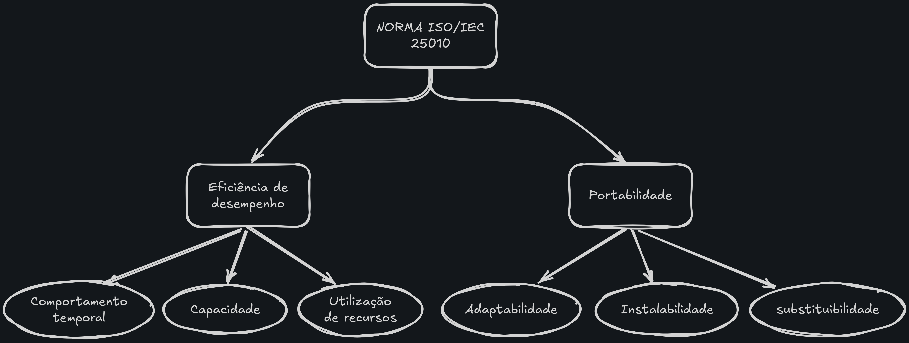

# 2.5 Modelo de Qualidade e Escopo

O objetivo desta página é representar o modelo de qualidade (ISO/IEC 25010) com foco em definir o escopo e a profundidade de análise para cada das características com maior prioridade:  

- Eficiência de Desempenho
- Portabilidade

## visão geral

## 2.5.1 Escopo e adaptação do modelo

O escopo se limitará na análise das duas características de qualidade mais relevantes para o projeto, que são: eficiência de desempenho e portabilidade.
O modelo de qualidade ISO/IEC 25010 será adaptado para incluir apenas as subcaracterísticas relevantes para essas duas características segundo o cenário de uso definido anteriormente em [Cenário de Uso](./proposito.md#cenario-de-uso), garantindo uma análise mais focada e eficiente.

### 2.5.2 Eficiência de Desempenho

> **definição segundo a norma:** desempenho relativo à quantidade de recursos usados sob condições declaradas.
>> NOTA : Recursos podem incluir outros produtos de software, a configuração de software e hardware do sistema, e materiais (ex. papel para impressão, mídia de armazenamento).

tabela com as subcaracterísticas relevantes para eficiência de desempenho:

| Subcaracterística | Descrição (SQuaRE) | Relevância para o projeto (1-5) | Justificativa para a relevância |
|-------------------|--------------------|---------------------------------| --------------------------------|
| Comportamento temporal | grau em que os tempos de resposta e processamento e as taxas de transferência de um produto ou sistema, ao executar suas funções, atendem aos requisitos. | 5 | Tem influência direta na experiência dos stakeholders na execução. |
| Utilização de recursos | grau em que as quantidades e tipos de recursos usados por um produto ou sistema, ao executar suas funções, atendem aos requisitos. | 5 | Os recursos utilizados devem ser otimizados para garantir o desempenho adequado, segundo o cenário de uso. |
| Capacidade | grau em que os limites máximos de um parâmetro de produto ou sistema atendem aos requisitos. | 5 | Impacta diretamente na capacidade do sistema de atender às necessidades dos stakeholders. |

### 2.5.3 Portabilidade

> **definição segundo a norma:** grau de eficácia e eficiência com que um sistema, produto ou componente pode ser transferido de um ambiente operacional ou de uso para outro.
>> NOTA 1 Adaptado de ISO/IEC/IEEE 24765.

>> NOTA 2 Portabilidade pode ser interpretada como uma capacidade inerente do produto ou sistema para facilitar as atividades de portabilidade, ou a qualidade em uso experimentada para o objetivo de portar o produto ou sistema.

tabela com as subcaracterísticas relevantes para portabilidade:

| Subcaracterística | Descrição (SQuaRE) | Relevância para o projeto (1-5) | Justificativa para a relevância |
|-------------------|--------------------|---------------------------------| --------------------------------|
| Adaptabilidade | grau em que um produto ou sistema pode ser adaptado de forma eficaz e eficiente para diferentes ou evoluindo hardware, software ou outros ambientes operacionais ou de uso. | 5 | De grande relevância para o projeto, pois permite a adaptação do sistema a diferentes ambientes. |
| Instalabilidade | grau de eficácia e eficiência com que um produto ou sistema pode ser instalado e ou desinstalado com sucesso em um ambiente especificado. | 5 | Relevante para a análise do projeto, pois impacta na facilidade de implantação. |
| Substituibilidade | grau em que um produto pode substituir outro produto de software especificado para o mesmo propósito no mesmo ambiente. | 2 | Para a análise do projeto, a substituibilidade é de menor relevância, pois os stakeholders não têm pretenção de substituir o produto por outro. |

---

## Referências

> 1. ISO/IEC 25010 *Software engineering – Software product Quality Requirements and Evaluation
(SQuaRE) – Quality model.*
<https://www.iso.org/standard/35733.html>
> 2. ISO/IEC 25021 *Software engineering - Software product Quality Requirements and Evaluation
(SQuaRE) – Quality measure elements.*
<https://www.iso.org/standard/35745.html>

---

## Histórico de Versão

| Versão | Data | Descrição | Autor | Revisor |
|--------|------|-----------|-------|---------|
| 1.0 | 12/05/2026 | Criação da página de escopo e modelos (Eficiência de desempenho e Portabilidade) | [Gabriel Alves](https://github.com/GdevAlves) | [Matheus Pinheiro](https://github.com/matheus-06) |
|1.1|13/05/2026|Adição do histórico de versão e referências|[Matheus Pinheiro](https://github.com/matheus-06)|[Gabriel Alves](https://github.com/GdevAlves)|
| 1.2|13/05/2026|Adição de justificativas para a relevância das subcaracterísticas|[Gabriel Alves](https://github.com/GdevAlves)|[Matheus Pinheiro](https://github.com/matheus-06)|