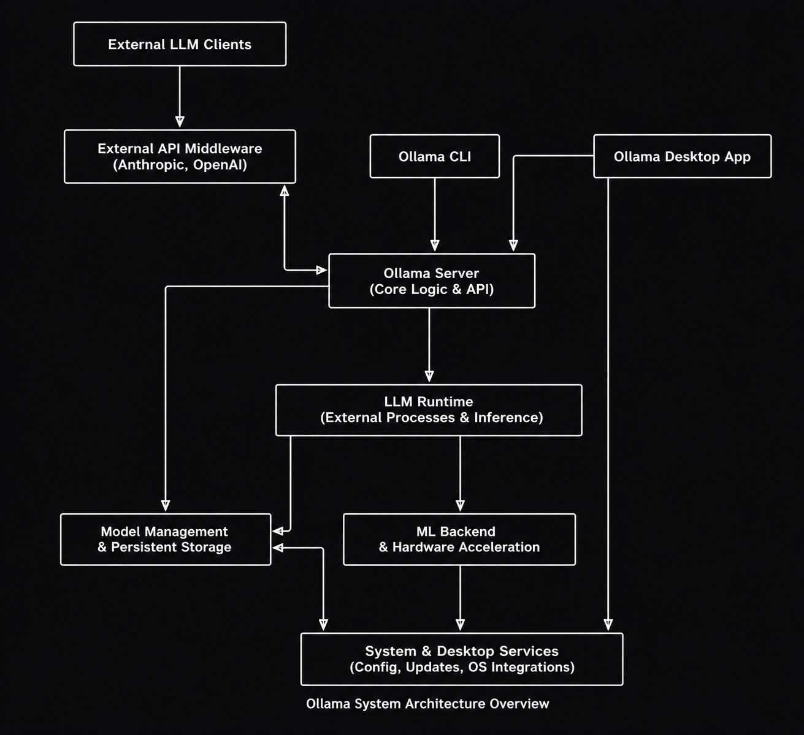
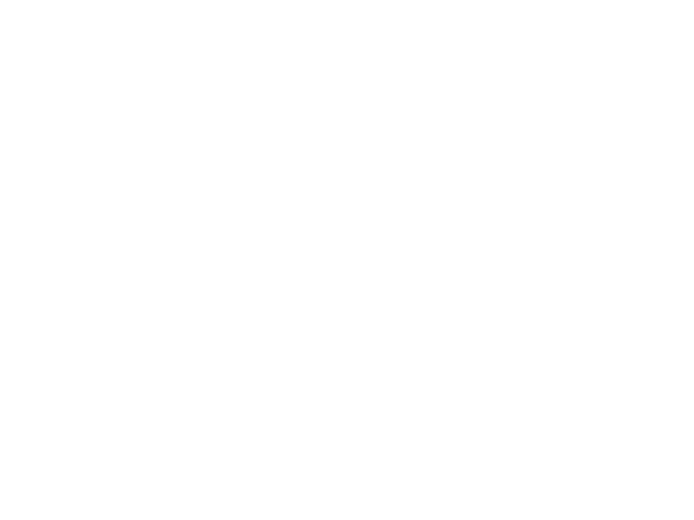

# 2.3 Descrição do Produto

O objetivo desta página é fornecer uma visão geral do software em avaliação e apresentar suas principais características técnicas e funcionais.
 
---


 
## Informações Básicas
 
- **Nome do produto**: Ollama
- **Versão do produto**: v0.23.4 (versão mais recente estável, maio de 2026)
- **Aplicação do produto**: Servidor de inferência local para Modelos de Linguagem de Grande Escala (LLMs)
- **Repositório do Código Principal**: [GitHub — ollama/ollama](https://github.com/ollama/ollama)
- **Licença do Produto**: MIT License
- **Linguagem de implementação**: Go (Golang)
- **Site oficial**: [https://ollama.com](https://ollama.com)
- **Documentação oficial**: [https://docs.ollama.com](https://docs.ollama.com)
---
 
## Sobre o Ollama
 
### O que é?
 
O **Ollama** é uma ferramenta de código aberto que permite executar Modelos de Linguagem de Grande Escala (LLMs) diretamente na máquina local do usuário, sem depender de serviços em nuvem ou chaves de API externas. Com um único comando no terminal, é possível baixar e executar modelos como Llama 3, Mistral, Gemma, DeepSeek, Qwen, entre mais de 100 outros disponíveis na biblioteca oficial.
 
O projeto foi criado para **remover as barreiras técnicas** que historicamente tornavam o uso de LLMs complexo: configuração de ambientes, gerenciamento de pesos de modelos, aceleração por GPU e compatibilidade de hardware. O Ollama abstrai toda essa complexidade, oferecendo uma interface simples tanto para uso via linha de comando quanto para integração via API REST.
 
### Arquitetura técnica



 <p align="center"><b>Fonte:</b> <a href="https://codewiki.google/github.com/ollama/ollama">Imagem gerada com Code Wiki</a>, 2026.</p>

O Ollama utiliza uma arquitetura **cliente-servidor**:
 
- O **cliente** é a interface de linha de comando (CLI) pela qual o usuário digita comandos.
- O **servidor** roda em segundo plano, sendo responsável por gerenciar modelos e processar requisições de inferência.
Como motor de inferência, o Ollama utiliza internamente o **llama.cpp**, otimizado para rodar modelos em hardware convencional, mesmo sem GPU dedicada. Quando uma GPU está disponível, o Ollama a detecta automaticamente e a utiliza para acelerar as respostas — com suporte a **NVIDIA (CUDA)**, **AMD (ROCm)** e **Apple Silicon (Metal)**. Na ausência de GPU, o processamento recai sobre a CPU.
 
A API REST embutida escuta por padrão na porta **11434** e é compatível com o formato da API da OpenAI, permitindo que aplicações já integradas com serviços em nuvem sejam redirecionadas para uma instância local com mínimas alterações de código.
 
Os modelos são armazenados localmente em `$HOME/.ollama/models` e gerenciados por um sistema de conteúdo endereçável, similar ao funcionamento de contêineres Docker.
 
---
 
## Sobre o uso do Ollama
 
- **Funções do produto**: execução local de LLMs, gerenciamento de modelos, inferência de texto, geração de embeddings, suporte a modelos multimodais (texto + imagem), integração via API REST
- **Classificação do produto**: AI Inference Server, Open-Source, Local-First
- **Público-alvo**: desenvolvedores de software, pesquisadores, cientistas de dados, profissionais de TI, entusiastas de IA
- **Ambientes de uso**: desenvolvimento local, pipelines de automação, aplicações empresariais com requisitos de privacidade, ambientes educacionais, pesquisa acadêmica
- **Dispositivos**: Desktop, Notebook (com suporte a macOS, Windows e Linux)
- **Conectividade**: funciona **completamente offline** para execução e inferência; utiliza internet apenas para baixar modelos do repositório oficial (`registry.ollama.ai`)
- **Suporte técnico**: comunidade ativa via GitHub Issues, Discord oficial, e documentação em [docs.ollama.com](https://docs.ollama.com); sem suporte comercial oficial para a versão local
### Modelos disponíveis
 
A biblioteca oficial do Ollama conta com mais de **100 modelos prontos para uso**, organizados nas seguintes categorias:
 
| Categoria | Exemplos de modelos |
|---|---|
| Uso geral / chat | Llama 3.3, Mistral, Gemma 3, Qwen 3 |
| Geração de código | Code Llama, DeepSeek Coder, Phi-4 |
| Raciocínio | DeepSeek-R1, QwQ |
| Multimodal (texto + imagem) | LLaVA, Llama 3.2 Vision, Qwen-VL |
| Embeddings | nomic-embed-text, mxbai-embed-large |
 
### Integrações e ecossistema
 
O Ollama possui um ecossistema amplo de integrações com ferramentas populares do mercado:
 
- **Interfaces gráficas**: Open WebUI, Enchanted, Ollama App
- **IDEs e editores de código**: Continue (VS Code), Cline, Void
- **Frameworks de IA**: LangChain, LlamaIndex
- **Agentes de codificação**: Claude Code, GitHub Copilot CLI, OpenCode
- **SDKs oficiais**: Python (`ollama-python`) e JavaScript/TypeScript (`ollama-js`)
### Planos e preços
 
| Modalidade | Custo | Características |
|---|---|---|
| **Local (padrão)** | Gratuito, sem limite | Execução offline, sem conta necessária, privacidade total |
| **Cloud Free** | Gratuito com conta | Acesso a modelos maiores em infraestrutura remota |
| **Cloud Pro** | US$ 20/mês | 3 modelos simultâneos em nuvem, maior volume de uso |
| **Cloud Max** | US$ 100/mês | 10 modelos simultâneos, uso intensivo |
 
> **Importante**: a funcionalidade local é **completamente gratuita e sem restrições**. A camada de nuvem é opcional e foi introduzida em setembro de 2025.
 
---
 
## Como as ODS se relacionam com o Ollama
 
**ODS 4 – Educação de Qualidade**
 
O Ollama é uma ferramenta gratuita e de código aberto que democratiza o acesso a tecnologias de inteligência artificial avançadas. Ao eliminar a necessidade de chaves de API pagas e de conexão constante com a internet, ele viabiliza que estudantes, professores e pesquisadores — inclusive em contextos de menor infraestrutura — possam estudar, experimentar e desenvolver com LLMs de ponta. Isso contribui diretamente para a redução das barreiras de acesso à educação tecnológica e para a formação de profissionais qualificados em IA, alinhando-se ao ODS 4, que busca assegurar educação inclusiva, equitativa e de qualidade para todos.
 
**ODS 9 – Indústria, Inovação e Infraestrutura**
 
O Ollama representa um avanço significativo na democratização da infraestrutura de IA. Ao permitir que organizações de qualquer porte executem modelos sofisticados em hardware comum, sem custos de API ou dependência de grandes provedores de nuvem, o software fomenta a inovação descentralizada. Pequenas empresas, startups e times independentes passam a ter acesso à mesma capacidade técnica anteriormente restrita a grandes corporações, alinhando-se ao ODS 9, que busca construir infraestruturas resilientes, promover a industrialização inclusiva e fomentar a inovação.
 
**ODS 10 – Redução das Desigualdades**
 
A filosofia *local-first* do Ollama contribui para reduzir a desigualdade no acesso à IA. Modelos de linguagem poderosos, antes acessíveis apenas mediante pagamento por uso a empresas como OpenAI e Anthropic, tornam-se disponíveis gratuitamente a qualquer pessoa com um computador convencional. Isso é especialmente relevante em países em desenvolvimento, onde os custos de acesso a APIs externas podem ser proibitivos. O Ollama, portanto, alinha-se ao ODS 10 ao ampliar o acesso equitativo a tecnologias transformadoras.
 
---
# Qwen 2.5 3B


 
# Informações Gerais do Produto

**Nome do produto:** Qwen2.5-3B

**Versão do produto:** Qwen2.5-3B (lançado em setembro de 2024, integrante da família Qwen2.5)

**Aplicação do produto:** Modelo de Linguagem de Pequeno Porte (SLM - Small Language Model) para geração de texto, chatbots, agentes inteligentes, programação, raciocínio matemático, processamento de dados estruturados e automação baseada em IA.

**Organização responsável:** Qwen Team (Alibaba Cloud)

**Repositório do Código Principal:** https://github.com/QwenLM/Qwen2.5

**Licença do Produto:** Qwen Research License (licença específica para a variante 3B). Diferentemente da maioria dos modelos da família Qwen2.5, que utilizam Apache 2.0, o Qwen2.5-3B é distribuído sob esta licença própria.

**Linguagem de implementação:** Python (ecossistema de treinamento e inferência), com arquitetura baseada em Transformers. Compatível com frameworks como Hugging Face Transformers, vLLM, SGLang, Ollama e llama.cpp.

**Site oficial:** https://qwenlm.github.io/

**Página oficial do modelo:** https://huggingface.co/Qwen/Qwen2.5-3B

**Documentação oficial:** https://qwen.readthedocs.io/


## O que é o Qwen 2.5 3B

O **Qwen 2.5 3B** é um modelo de linguagem de pequeno porte (**SLM - Small Language Model**) desenvolvido pela equipe **Qwen**, da Alibaba Cloud. Ele faz parte da mais recente geração de modelos fundacionais da família **Qwen2.5**, pré-treinados em um conjunto massivo de dados contendo até **18 trilhões de tokens**.

Apesar do seu tamanho compacto, com aproximadamente **3 bilhões de parâmetros**, ele possui uma alta densidade de conhecimento, entregando um desempenho altamente competitivo que rivaliza com modelos maiores e alcançando uma pontuação superior a **65 no benchmark MMLU**.

> **Observação sobre licenciamento:** Enquanto a maior parte da linha Qwen2.5 utiliza a licença **Apache 2.0**, as variantes **3B** e **72B** foram lançadas sob a **Qwen Research License**.

---

# Arquitetura Técnica



 <p align="center"><b>Fonte:</b> <a href="https://codewiki.google/github.com/qwenlm/qwen2.5-vl#qwen25-vl-model-core-functionality">Imagem gerada com Code Wiki</a>, 2026.</p>

O Qwen2.5-3B é construído sobre uma arquitetura Transformer otimizada, incorporando avanços tecnológicos como **RoPE (Rotary Position Embeddings)**, **SwiGLU**, **RMSNorm**, **QKV Attention Bias** e **Tied Word Embeddings**. Ele utiliza uma configuração de atenção do tipo **Grouped-Query Attention (GQA)**, com 16 cabeças para Queries (Q) e 2 cabeças para Key-Values (KV), o que contribui para sua eficiência computacional e capacidade de lidar com contextos longos.

## Especificações Técnicas

### Parâmetros

* **Total de parâmetros:** 3,09 bilhões
* **Parâmetros não embutidos (non-embedding):** 2,77 bilhões

### Camadas e Atenção

* **36 camadas**
* Utiliza **Grouped-Query Attention (GQA)**
* **16 cabeças de atenção para Queries (Q)**
* **2 cabeças para Key-Values (KV)**

### Janela de Contexto

* Suporta até **128.000 tokens de contexto**
* Capacidade de gerar até **8.192 tokens** por resposta

### Componentes Arquiteturais

A arquitetura Transformer incorpora tecnologias modernas como:

* **RoPE (Rotary Position Embeddings)**
* **SwiGLU**
* **RMSNorm**
* **QKV Attention Bias**
* **Tied Word Embeddings**

---

# Uso e Capacidades

A versão **Qwen2.5-3B-Instruct** apresenta avanços significativos em relação à geração anterior.

## Suporte Multilíngue

Oferece suporte para mais de **29 idiomas**, incluindo:

* Português
* Inglês
* Chinês
* Espanhol
* Francês
* Japonês

## Programação e Matemática

O modelo possui melhorias expressivas em:

* Resolução de problemas matemáticos
* Geração de código
* Depuração de código
* Compreensão de lógica computacional

Essas capacidades foram aprimoradas através da incorporação de conhecimentos oriundos de modelos especialistas nesses domínios.

## Dados Estruturados e JSON

O modelo demonstra excelente desempenho em:

* Interpretação de tabelas
* Processamento de dados estruturados
* Geração de saídas JSON
* Extração e organização de informações

## Chatbots e Role-Play

O Qwen2.5-3B apresenta:

* Alta resiliência a diferentes prompts de sistema
* Melhor aderência a instruções
* Maior estabilidade em cenários de chatbot
* Excelente capacidade de interpretação de papéis (*role-play*)

---

# Integração e Ecossistemas

O modelo foi desenvolvido para funcionar de forma integrada com as principais ferramentas da comunidade de IA.

## Hugging Face

A forma mais simples de utilização ocorre através da biblioteca **Transformers** da Hugging Face.

### Requisito Importante

Utilize versões:

```bash
transformers >= 4.37.0
```

Versões anteriores podem causar incompatibilidades e erros de carregamento.

---

## Implantação e Execução Local

O modelo pode ser servido ou executado utilizando:

### Servidores de Inferência

* vLLM
* SGLang

### Execução Local

* Ollama
* llama.cpp
* LM Studio

Ferramentas como **vLLM** e **Ollama** permitem expor uma API compatível com o padrão da OpenAI.

---

## Tool Calling

O Qwen2.5-3B possui suporte nativo para **Tool Calling** (chamadas de ferramentas).

### Plataformas Compatíveis

* vLLM (>= 0.6)
* Ollama
* Hugging Face Transformers

### Compatibilidade

O template utilizado foi inspirado no modelo **Hermes (Nous Research)**, mantendo compatibilidade com:

* Template antigo do Qwen2
* Qwen-Agent
* Ecossistema legado da família Qwen

---

## Fine-Tuning e Quantização

O modelo é compatível com diversos frameworks de treinamento e otimização.

### Fine-Tuning

* PEFT
* Llama-Factory
* Unsloth
* Swift

### Quantização

* AutoGPTQ
* AutoAWQ

---

# Principais Vantagens

* Modelo compacto com apenas 3 bilhões de parâmetros
* Contexto extremamente longo (128k tokens)
* Excelente desempenho em programação e matemática
* Forte suporte multilíngue
* Ótima geração de JSON e dados estruturados
* Compatível com Ollama, vLLM e Hugging Face
* Suporte nativo para Tool Calling
* Amplo suporte para fine-tuning e quantização

---


 
## Bibliografia
 
> 1. OLLAMA. *Ollama — The easiest way to build with open models*. Disponível em: <https://ollama.com>. Acesso em: 11 maio 2026.
 
> 2. OLLAMA. *Ollama — Repositório oficial*. GitHub, 2026. Disponível em: <https://github.com/ollama/ollama>. Acesso em: 11 maio 2026.
 
> 3. OLLAMA. *Documentação oficial do Ollama*. Disponível em: <https://docs.ollama.com>. Acesso em: 11 maio 2026.
 
> 4. OLLAMA. *Biblioteca de modelos do Ollama*. Disponível em: <https://ollama.com/library>. Acesso em: 11 maio 2026.
 
> 5. TOOLCHASE. Ollama Review 2026 — Pricing, Features & Alternatives. **ToolChase**, 2026. Disponível em: <https://toolchase.com/tool/ollama/>. Acesso em: 11 maio 2026.
 
> 6. INFRALOVERS. Ollama in 2025: Major Updates Transform Local AI Experience. **Infralovers**, ago. 2025. Disponível em: <https://www.infralovers.com/blog/2025-08-13-ollama-2025-updates/>. Acesso em: 11 maio 2026.
 
> 7. SKYWORK AI. What is Ollama? Complete Guide to Local AI Models 2025. **Skywork**, out. 2025. Disponível em: <https://skywork.ai/blog/agent/what-is-ollama-complete-guide-to-local-ai-models-2025/>. Acesso em: 11 maio 2026.
 
> 8. DEEPWIKI. System Requirements — ollama/ollama. **DeepWiki**, 2025. Disponível em: <https://deepwiki.com/ollama/ollama/1.2-system-requirements>. Acesso em: 11 maio 2026.
 
> 9. OHIO SUPERCOMPUTER CENTER. Ollama. **OSC**, 2025. Disponível em: <https://www.osc.edu/resources/available_software/software_list/ollama>. Acesso em: 11 maio 2026.
 
> 10. BYTESIZEGO. Exploring Ollama: Running LLMs Locally with Go. **ByteSizeGo**, dez. 2025. Disponível em: <https://www.bytesizego.com/blog/exploring-ollama-running-llms-locally-with-go>. Acesso em: 11 maio 2026.
 
> 11. ORGANIZAÇÃO DAS NAÇÕES UNIDAS. Objetivo de Desenvolvimento Sustentável 4: Educação de qualidade. Disponível em: <https://brasil.un.org/pt-br/sdgs/4>. Acesso em: 11 maio 2026.
 
> 12. ORGANIZAÇÃO DAS NAÇÕES UNIDAS. Objetivo de Desenvolvimento Sustentável 9: Indústria, inovação e infraestrutura. Disponível em: <https://brasil.un.org/pt-br/sdgs/9>. Acesso em: 11 maio 2026.
 
> 13. ORGANIZAÇÃO DAS NAÇÕES UNIDAS. Objetivo de Desenvolvimento Sustentável 10: Redução das desigualdades. Disponível em: <https://brasil.un.org/pt-br/sdgs/10>. Acesso em: 11 maio 2026.
 
---
 
## Histórico de Versão
 
| Versão | Data | Descrição | Autor | Revisor |
|---|---|---|---|---|
| 1.0 | 11/05/2026 | Criação da descrição do produto Ollama | [Johnnatan Salles](https://github.com/jsalless) | [Renata Quadros](https://github.com/RenataKurzawa) |
| 1.1 | 13/05/2026 | Correção na versão atual do Ollama | [Matheus Pinheiro](https://github.com/matheus-06) | [](https://github.com/) |
| 2.0 | 13/05/2026 | Inserção de informações sobre o Qwen2.5-3B | [Luiza](https://github.com/Luizaxx) | [Johnnatan Salles](https://github.com/jsalless) |
| 2.1 | 13/05/2026 | Inserção de diagrama de arquitetura Ollamac| [Luiza](https://github.com/Luizaxx) | [Johnnatan Salles](https://github.com/jsalless) |

